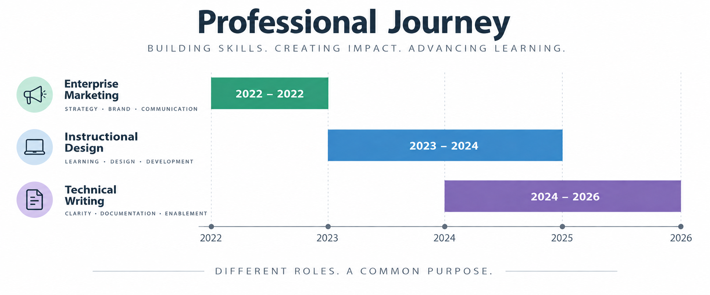

<meta name="robots" content="noindex, nofollow">

# Jay's Instructional Design Portfolio

Welcome to my instructional design portfolio!

My experience blends training and technical writing for Software-as-a-Service (SaaS) companies. I love online courses, and, as a new employee, **I have greatly benefited from good training**. I would like to pay it forward and share those experiences with others.

I have worked for both smaller startups and large multinational corporations, and I have experience with the following content types:

* eLearning Courses
* Videos
* Manuals
* One-Pagers
* Quizzes
* Job Aids

I have created training materials for the following audiences:

* Customers
* Employees
* Partners (some experience)

The portfolio includes:

* [eLearning Course](#elearning-course)
* [Video](#video)

## eLearning Course

I created an eLearning course for a new loyalty feature for a mobile Point-of-Sale (mPOS) system with Articulate Rise.

[eLearning Course: Getting Started With Loyalty](https://drive.google.com/drive/u/1/folders/1meF1igQ5ulkhRUELkiW-phpVE7yeh12T)

## Video

I developed a video script for a new microsite for online ordering with a mobile Point-of-Sale (mPOS) system.

To produce the video, I collaborated with colleagues in a creative studio who provided the voiceovers and graphics.

[Microsite Video](https://drive.google.com/drive/u/1/folders/1meF1igQ5ulkhRUELkiW-phpVE7yeh12T)
